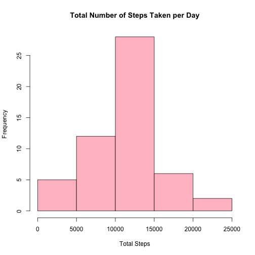
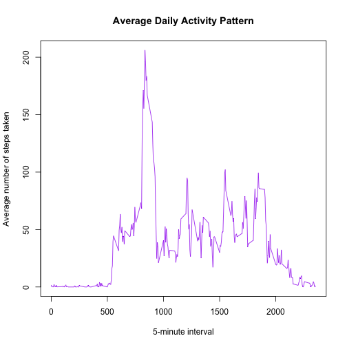
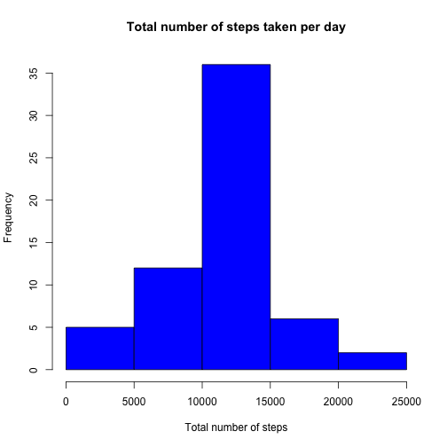
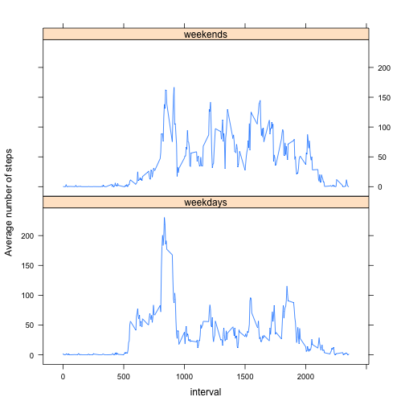

Reproducible Research Assignment 1
======================================

### Loading and preprocessing the data


```r
rawdata<-read.csv("activity.csv",header = T)
```

### What is mean total number of steps taken per day?

1. Aggregate the total number of steps by date  


```r
DailySteps<-aggregate(rawdata$steps, by=list(date= rawdata$date), FUN = sum)
```

2. Make a histogram


```r
hist(DailySteps$x, main = "Total Number of Steps Taken per Day", xlab = "Total Steps", col = "pink")
```

 

```r
meanSteps<-mean(DailySteps$x, na.rm = T)
medianSteps<-median(DailySteps$x, na.rm = T)
```

**The mean of total steps taken per day is 1.0766189 &times; 10<sup>4</sup>; the median is 10765**

### What is the daily avtivity pattern?

create a table with NA's removed


```r
data<-na.omit(rawdata)
```

create a table with average number of steps taken over time intervals


```r
avgSteps<-aggregate(data$steps, by = list(interval = data$interval), FUN = mean)
```

Make a time series plot of average number of steps taken for 5-minute interval per day


```r
plot(avgSteps$interval, avgSteps$x, type = "l", col = "purple", main = "Average Daily Activity Pattern", xlab = "5-minute interval", ylab = "Average number of steps taken")
```

 

Calculate the interval of maximum number of steps taken

```r
interval_MaxStep<-avgSteps[avgSteps$x==max(avgSteps$x), ][[1]]
```

**The maximum number of steps taken was in the 835 of 5-minute interval**

### Imputing missing values


```r
missings<-sum(is.na(rawdata))
```

**The total nunmber of missing value in data set is 2304**

Filling in missing values in datasets by using average number of steps per interval


```r
newdata<-merge(rawdata, avgSteps, by = "interval")
nas<-is.na(newdata$steps)
newdata$steps[nas]<-newdata$x[nas]
```

new dataset is as follows:


```r
head(newdata[1:3])
```

```
##   interval    steps       date
## 1        0 1.716981 2012-10-01
## 2        0 0.000000 2012-11-23
## 3        0 0.000000 2012-10-28
## 4        0 0.000000 2012-11-06
## 5        0 0.000000 2012-11-24
## 6        0 0.000000 2012-11-15
```

Total number of steps taken per day with missing value filled:


```r
newDSteps<-aggregate(newdata$steps, by=list(date=newdata$date), FUN = sum)
hist(newDSteps$x, main = "Total number of steps taken per day", xlab = "Total number of steps", col = "blue")
```

 
The new mean is 

```r
mean(newDSteps$x)
```

```
## [1] 10766.19
```
The new median is 

```r
median(newDSteps$x)
```

```
## [1] 10766.19
```

**Yes. These value differs from the values with missing data**

**The mean and median are now the same. Meaning there is less bias**

### Are there differences in activity patterns between weekdays and weekends?

Add a new variable to indicate weekdays and weekend


```r
newdata$days<-weekdays(as.Date(newdata$date))
weekend<-newdata$days %in% c("Saturday", "Sunday")
newdata$daysInd[weekend]<-"weekends"
newdata$daysInd[is.na(newdata$daysInd)]<-"weekdays"

weekdata<-newdata[c(1,2,3,6)]
head(weekdata)
```

```
##   interval    steps       date  daysInd
## 1        0 1.716981 2012-10-01 weekdays
## 2        0 0.000000 2012-11-23 weekdays
## 3        0 0.000000 2012-10-28 weekends
## 4        0 0.000000 2012-11-06 weekdays
## 5        0 0.000000 2012-11-24 weekends
## 6        0 0.000000 2012-11-15 weekdays
```

Make a time series plot of 5-minute interval and average number of steps taken accross weekends and weekdays


```r
agg<-aggregate(steps~interval + daysInd, weekdata, mean)

library(lattice)

xyplot(steps~interval | daysInd, data = agg, type = "l",layout = c(1,2), xlab = "interval", ylab = "Average number of steps")
```

 


